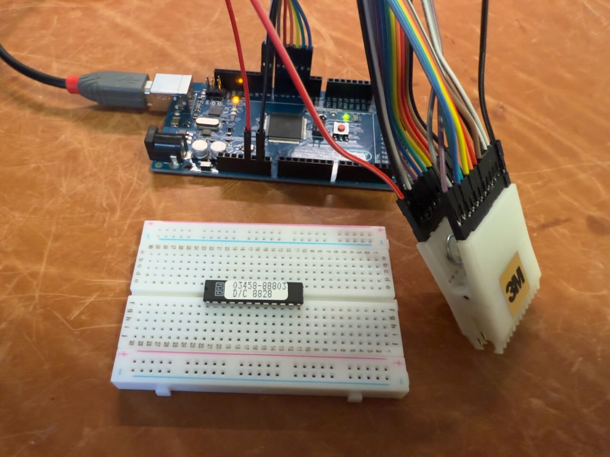

# Dumping some of the PAL

I could not find an easy way to dump U105 and U106, which are 8L14 PALs (8 inputs, 14 outputs), so I wrote a tiny [Arduino app](PAL_READER.ino) for an Arduino Mega 2560 and wired it up as follows:

Inputs:
Pin 3-10 on the PAL to pin 2-9 on the Mega

Outputs:
Pin 1,2,11,13-23 to pin 22-48 (only the even pins)

Also:
GND (to pin 12) and +5V (to pin 24)

It is not actually necessary to desolder the PAL, you can attach the clip directly to the PAL on the (unpowered!) board, which is what I did for the second PAL.