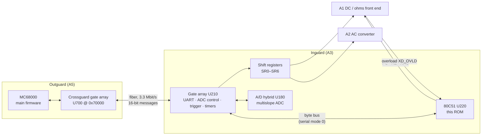
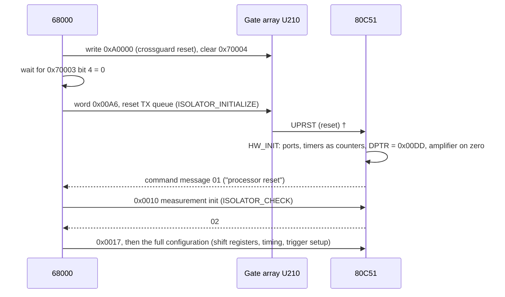
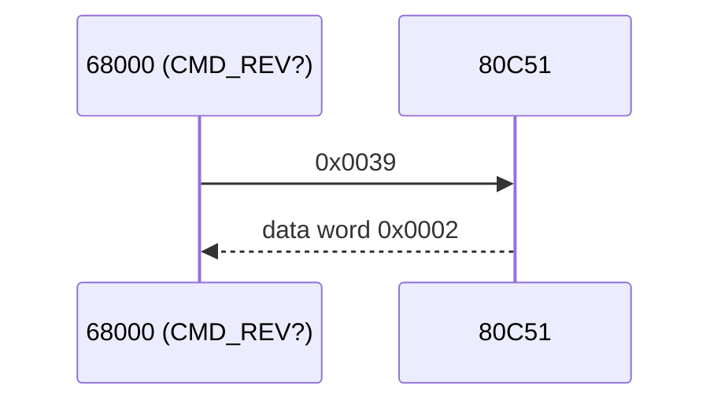
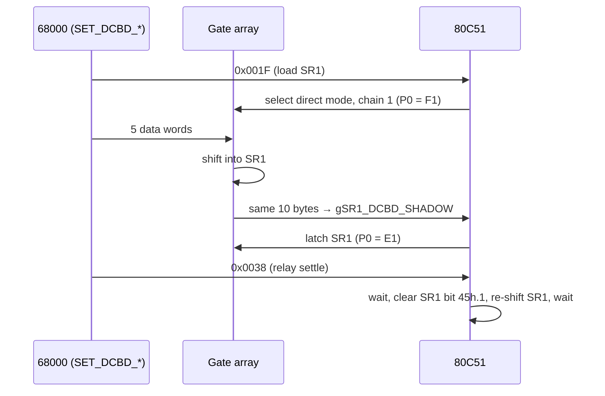
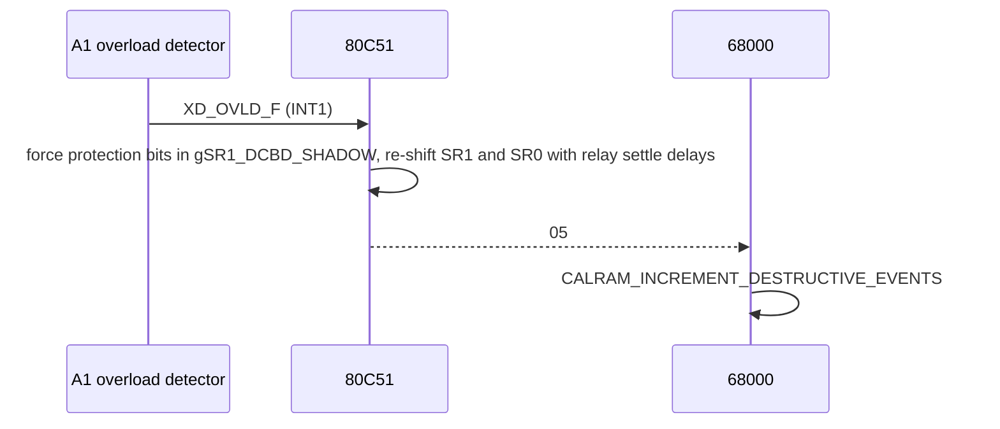

# HP 3458A Inguard Controller — A3U220 80C51 (03458-85501 Rev 1)

Reference for the inguard microcontroller of the HP 3458A and for the link between it and the outguard 68000.

| | |
|---|---|
| ROM image | `A3_U220_Intel_P80C51BH_03458-85501_Rev1.BIN` — 4096 bytes, internal mask ROM of an Intel P80C51BH |
| Board | **A3 "A/D Inguard Logic"** (03458-66503), position U220 |
| Firmware revision | 2 (reply to `REV?`, opcode 0x39) |
| Annotated listing | [`inguard_80c51_disasm.txt`](inguard_80c51_disasm.txt) |
| Ghidra | project [`A3 U220.gpr`](A3%20U220.gpr), scripts [`ghidra_scripts/`](ghidra_scripts/) — see [§9](#9-ghidra-project) |

> **Not the front panel.** The CLIP parts list puts `A3U220 03458-85501` on the A/D inguard board, next to the A/D hybrid
> (U180), the 6000-gate CMOS gate array (U210), a 20 MHz oscillator (U230) and the HFBR-1510/2501 fiber-optic parts.
> The front-panel 80C51 is a different chip, **A6U400 (03458-85502)**, whose ROM is not in this repository.

Statements marked † are inferred from behaviour or from the name of the 68000 routine involved. Everything else
is read directly from the 80C51 code, the 68000 code (`output_rev9.bin`) or the CLIP schematics.

---

## Contents

1. [Role in the instrument](#1-role-in-the-instrument)
2. [Hardware interface](#2-hardware-interface)
3. [Inguard–outguard link](#3-inguardoutguard-link)
4. [Typical transactions](#4-typical-transactions)
5. [Command reference](#5-command-reference)
6. [Timing and count encodings](#6-timing-and-count-encodings)
7. [How the 68000 drives a measurement](#7-how-the-68000-drives-a-measurement)
8. [Firmware internals](#8-firmware-internals)
9. [Ghidra project](#9-ghidra-project)
10. [Sources](#10-sources)

---

## 1. Role in the instrument

The 3458A is split into a ground-referenced **outguard** section (68000 main CPU, HP-IB, front panel) and a floating
**inguard** section (input front ends and the multislope ADC). The two halves talk over a fiber-optic serial link with a
custom UART implemented in gate arrays on both sides (HP Journal, April 1989, pp. 31–36).

On the inguard side the ADC sequencing runs in hardware: the gate array U210 has the 20 MHz ADC state machines, trigger
logic, timers and the UART. The 80C51 is the **controller around that hardware**:

* It parses command messages from the 68000 and drives the gate array through a small register interface.
* It loads the configuration **shift registers** of the DC front end, the AC board and the ADC.
* It sequences measurements: arm, trigger, DELAY/TIMER timing, reading counts, autozero and offset-compensation pairs, and subsampling bursts.
* It switches the DC input amplifier between input, zero and precharge.
* It reacts to an input **overload** by re-sequencing the protection relays.
* It reports events back to the 68000: reset, overload, front/rear terminal change, trigger too fast, sequence done.

The ADC readings themselves do **not** pass through the 80C51. The gate array sends them to the outguard directly.



---

## 2. Hardware interface

### 2.1 Pin map

From the CLIP schematic, A3 sheet 1 "IN-GRD CTL & INTERPOLATOR", block "IN GUARD CONTROL LOGIC". U220 runs from the gate
array's 10 MHz clock `CK10` (into XTAL2) and has **no external bus** (EA tied high, ALE/PSEN not connected).
Apart from the input-amplifier switches and two status inputs, every signal goes to the gate array.

| Pin | Net | Direction / destination | Function |
|---|---|---|---|
| P3.0 RXD | `UPDA` | ↔ U210 | data of the byte bus (serial port **mode 0**, synchronous) |
| P3.1 TXD | `IGCLK` | → U210 | clock of the byte bus |
| P0.0–P0.3 | `ADD0`–`ADD3` | → U210 | gate-array register number |
| P0.4 | `XRXW` | → U210 | 1 = read, 0 = write |
| P0.5 | `NRDGOUT` | ← U210 | trigger / reading event (INT0 ISR starts the DELAY counter) |
| P0.6 | `BFSTAT` | ← U210 | UART buffer status: RX word ready / TX ready (polled by every transfer) |
| P0.7 | `OTHINT` | ← U210 | "other interrupt": status changed, read status register A |
| P2.3 | `IGSTB` | → U210 | transfer strobe (pulsed low after every register access) |
| P3.2 INT0 | `XINTR` | ← U210 | gate-array interrupt |
| P3.7 | `CMDI` | ← U210 | command-message indicator (INT0 ISR goes straight to the dispatcher) |
| P3.3 INT1 | `XD_OVLD_F` | ← A1 overload detector | input overload, high-priority interrupt (`IP = 04h`) |
| RESET | `UPRST` | ← U210 | the gate array resets the CPU |
| P3.4 T0 | `C0MIN` | ← U210 | Timer0 count input: 409.6 µs timebase ticks ([§6.1](#61-delay-and-timer)) |
| P3.5 T1 | `C1MIN` | ← U210 | Timer1 count input: one pulse per 256 readings ([§6.2](#62-reading-count-nrdgs)) |
| P1.0 | `LEVEL` | ← A2 AC board | AC level-trigger comparator (read by cmd 0x37) |
| P1.1 | `ADBSY` | ← U210 | A/D busy |
| P1.2 | `INCMP` / `XCINCMP` | ↔ U210 via 1 kΩ | ADC handshake: pulsed low to start, read back as done |
| P1.3 | `UPTRG` | → U210 | µP trigger: starts a reading |
| P1.4 | `ENTRG` | → U210 | enable trigger (arm) |
| P1.5 / P1.6 | `XCOT0` / `XCOT1` | → U210 | counter gates; XCOT1 is pulsed when the reading count is exhausted |
| P1.7 | `NRFT` | → U210, U212B | reading-done / flip-flop reset strobe |
| P3.6 | `INRFT` | → U211B | reset strobe at init and with register C |
| P2.4 | `XEXOR` | → U210 | **EXT OUT** pulse |
| P2.5 | `SEND` | → U210 | enable sending ADC readings over the UART |
| P2.6 | `HOLD` | → U210, U212A | A/D hold |
| P2.7 | `XETRG` | → U210 | start the A/D sequence |
| **P2.0** | `PC` | → A1 Q10 | **precharge** switch of the DC input amplifier (active high) |
| **P2.1** | `HZ` | → A1 Q11 | **zero** switch (active high) |
| **P2.2** | `XHC` | → A1 Q12 | **HI connect** switch (active low) |

### 2.2 Gate-array register interface

The 80C51's serial port in mode 0 is an 8-bit synchronous shift bus to the gate array. Every access goes the same way:

1. Write the register to P0. The low nibble is the register number, bit 4 (`XRXW`) is 1 to read and 0 to write, and the inputs P0.5–P0.7 are written as 1.
2. Where needed, wait for `BFSTAT` (P0.6).
3. Pulse `IGSTB` (P2.3) and shift one or two bytes through `SBUF`.

| P0 | Register | Access | Meaning |
|---|---|---|---|
| `FF` | F read | 1–2 bytes | **UART receive word** from the outguard. The first byte is the low byte (the opcode for commands). |
| `E7` | 7 write | 1–2 bytes | **UART transmit data word** |
| `E8` | 8 write | 1 byte | **UART transmit command message** (raises an interrupt on the 68000) |
| `E9` | 9 write | 1 byte | control register (RAM shadow `gGA_CTRL_SHADOW`, init 0x80) |
| `FA` | A read | 1 byte | status: bit 0 front/rear terminal, bit 2 terminal changed, bit 5 trigger event |
| `F8` / `F9` | 8 / 9 read | 1–2 bytes | counter capture: 8-bit event counter / 12-bit timebase (line-frequency measurement) |
| `FC` / `FD` | C / D read | 10 bytes | diagnostic read-back (cmds 0x2C / 0x2D) |
| `EA`–`ED` | A–D write | strobe | reset / clear strobes (counters, ADC, init) |
| `E0`–`E6` | 0–6 write | n bytes | **shift-register chain n**: shift out the RAM shadow, then latch |
| `F0`–`F6` | 0–6 read | 2·n bytes | **direct mode**: incoming UART words go into chain n *and* to the CPU |

Byte order on the transmit side: in a two-byte write, the first byte written becomes the **high** byte of the word and the second (strobed) byte the low byte. A one-byte write sends a word with that byte as the low byte.

### 2.3 Shift-register chains

Configuration of the analog circuits lives in serial shift registers that the gate array clocks. The 80C51 keeps a RAM copy
of each chain. It loads the chains in **direct mode**: the gate array routes the next UART words to the chain and to the CPU at
the same time, so the configuration goes in at link speed while the CPU stores the shadow. The shadow lets the CPU re-shift a chain later
with single bits changed, for the relay sequencing, the overload handling and offset compensation.

| Chain | RAM shadow | Bits | Loaded by | Contents | 68000 routines |
|---|---|---|---|---|---|
| SR0 | `gSR0_ACBD_SHADOW` 4Fh–58h | 80 | 0x20 | A2 AC converter configuration | `SET_ACBD_*` |
| SR1 | `gSR1_DCBD_SHADOW` 45h–4Eh | 80 | 0x1F | A1 DC/ohms front end: relays, FET drives, current source | `SET_DCBD_*` |
| SR2 | `gSR2_DELAY_FIRST` 7Bh–7Ch | 16 | 0x24, 0x0F | DELAY first partial period ([§6.1](#61-delay-and-timer)) | `0x291B0` |
| SR3 | `gSR3_TIMER_FIRST` 76h–77h | 16 | 0x23 | TIMER first partial period | `0x292D0` |
| SR4 | `gSR4_SHADOW` 6Dh–72h | 48 | 0x25 | 8-bit reading counter + trigger/count mode bits | `0x29048`, `0x2943E` |
| SR5 | `gSR5_ADMEM_SHADOW` 59h–64h | 96 | 0x21 | ADC slope / sequence memory | `ADMEM_SEND_*` |
| SR6 | `gSR6_ADCAL_SHADOW` 65h–6Ah | 48 | 0x22 | ADC calibration / offset | `ADCAL_SEND_*` |

These total 384 bits. The journal speaks of five registers with 460 bits, so the rest are probably internal to the gate array.

### 2.4 DC input-amplifier switches (A1)

P2.0–P2.2 leave A3 through 1 kΩ resistors (`PC_F`, `HZ_F`, `XHC_F`, connector P2 pins 12/11/10) to the A1 DC input board
("Sentry Input Signal Conditioning", sheet 4). There an LM339 (U11) level-shifts them to the −21 V gate drive of three
JFETs in front of the DC input amplifier:

| Signal | A1 path | Switch | Purpose |
|---|---|---|---|
| `PC` (P2.0) | U11D → bootstrapped gate drive → **Q10** | connects the amplifier input to `BOOT` (U12, buffered copy of the input) | **precharge**: charge the amplifier input to the input voltage first, so closing the HI switch takes almost no charge from the source |
| `HZ` (P2.1) | U11C → **Q11** | connects the amplifier input to the zero/low selector Q22–Q25 (ground, LO sense, ohms paths) | **zero** reference for autozero |
| `XHC` (P2.2, active low) | U11B → Q28 → **Q12** | connects the amplifier input to the selected input signal | **HI connect** |

| State | XHC | HZ | PC | Command |
|---|---|---|---|---|
| amplifier on input | 0 | 0 | 0 | 0x0A |
| amplifier on zero (power-up state) | 1 | 1 | 0 | 0x0B |
| precharge only | 1 | 0 | 1 | 0x0C |
| all open | 1 | 0 | 0 | 0x29 |
| input and zero together | 0 | 1 | 0 | 0x36 |

During measurements the firmware switches automatically:
* `SWITCH_TO_ZERO`: HI off, short wait, zero on, wait `gSWITCH_SETTLE`.
* `SWITCH_TO_INPUT_PRECHARGED`: zero off, precharge pulse of a few µs, HI on, wait `gSWITCH_SETTLE`.

HZ also clears U211A (`XENOV`), which disables the overload clamp sense while the amplifier is on zero.

---

## 3. Inguard–outguard link

### 3.1 Physical layer

From the HP Journal article "Custom UART Design" (Apr 1989, p. 36):

* Fiber-optic, one fiber per direction, **3.3 Mbit/s**. The UART runs at a 10 MHz clock with 3× oversampling.
* Every message starts with a start bit, followed by a **handshake bit**. If the handshake bit is low, the message is just a handshake and ends with a stop bit. A handshake goes back for every data word the receiver has read, so a new message is never sent before the previous one was taken.
* Otherwise **16 data bits** follow, then a **command/data bit** and the stop bit. Command messages raise an interrupt at the receiver; data messages don't.
* The inguard UART buffers outgoing messages from four sources: ADC error detection, the ADC output register, the trigger controller and the 80C51.

### 3.2 Outguard side (68000)

| Address | Access | Meaning |
|---|---|---|
| `0x70000` | word write | send a 16-bit word to the inguard |
| `0x70000` | word read | received 16-bit word |
| `0x70003` | byte read | status: bit 0 = word received, bit 1 = transmitter ready, bit 2 = must be 0 for a polled read †, bit 4 = busy during reset |
| `0x70003` | byte write | 2 = enable the transmit-ready interrupt, 0 = disable it |
| `0x70004` | word write | cleared during initialization |
| `0xA0000` | word write | crossguard reset (resets the inguard side) |

| 68000 routine | Address | Job |
|---|---|---|
| `ISOLATOR_ADD_SEND_BUFFER` | 0x2B5A2 | send one word. If the queue is empty and the transmitter is ready it writes `0x70000` directly, otherwise it queues the word (ring buffer 0x12128C–0x12138C, pointers 0x121284 / 0x121288, full flag 0x121282). |
| `ISOLATOR_SEND_BUFFER` | 0x2B614 | opcode word + n words from a buffer, under semaphore 9 |
| `ISOLATOR_0002b178` | 0x2B178 | opcode word + up to 3 argument words, under semaphore 9 |
| `IRQ_27_LEVEL_3_IRQ_ISOLATOR_SEND` | 0x2B65E | transmitter ready: drain the queue |
| `IRQ_26_LEVEL_2_IRQ_ISOLATOR_RECEIVE` | 0x2B6B4 | command message from the inguard: decode ([§3.5](#35-inguard--outguard-command-messages)) |
| `ISOLATOR_0002a8ae`, `ISOLATOR_GET_SLAVE_PROCESSOR_FIRMWARE_VERSION` | 0x2A8AE, 0x2A8F6 | polled read of one data word (reply values) |
| `ISOLATOR_0002a9c6`, `ISOLATOR_0002aa6e`, `ISOLATOR_0002ade8` | | read ADC readings |
| `ISOLATOR_0002ba6c` | 0x2BA6C | read N reading pairs; each reading is two words (high, low) forming a 32-bit count. Accumulates Σ(A − B). |
| `ISOLATOR_INITIALIZE` | 0x2B310 | reset the link ([§4.1](#41-start-up)) |

The fast reading paths copy words from `0x70000` straight into the HP-IB output register `0x8001E` (routine at 0x2B36C).
They are what make the 100,000 readings/s burst rate possible. The receive interrupt can rewind the interrupted PC inside those loops
(tables at 0x2B8C2 / 0x2B90A / 0x2B952) so that a command message arriving in the middle does not lose a reading.

### 3.3 Message types

| Direction | Type | Content |
|---|---|---|
| outguard → inguard | **command word** | low byte = opcode (0x00–0x3D), high byte = parameter |
| outguard → inguard | **argument / data words** | follow some opcodes; read by the handler, or routed to a shift register in direct mode |
| inguard → outguard | **data word** | reply values from the 80C51, and the ADC readings from the gate array |
| inguard → outguard | **command message** | event code in the low byte from the 80C51, or flag bits 8–13 from the gate array; interrupts the 68000 |

Byte order: the opcode is the **low byte** of the 16-bit word, because it is shifted in first. The 68000 sends e.g.
`0x0039` for `REV?`, `0x0115` for opcode 0x15 with parameter 1, and `0xC833` for opcode 0x33 (delay) with parameter 0xC8.
Multi-byte values in argument words go low byte first.

### 3.4 Command handling on the 80C51

Every received word raises INT0. The dispatcher (`CMD_DISPATCH`, 0x00C0) reads the first byte (the opcode):

* For opcode **≥ 0x3E** it replies with the command message `0A` (unknown command).
* Otherwise it jumps through a 62-entry `AJMP` table at 0x00DD (`RL A; JMP @A+DPTR` with DPTR fixed at 0x00DD).

A handler reads its parameter byte (the high byte of the command word) and any argument words itself.
Long measurement commands leave interrupt context and keep running in the foreground, so later commands (e.g. 0x2E "next reading",
0x09 "stop") still get through ([§8.2](#82-interrupt-and-foreground-model)).

### 3.5 Inguard → outguard command messages

Decoded by `IRQ_26_LEVEL_2_IRQ_ISOLATOR_RECEIVE`:

| Code / bit | Origin | Meaning | 68000 reaction |
|---|---|---|---|
| `01` | 80C51, power-up | the inguard processor has (re)started | `ISOLATOR_UNEXPECTED_SLAVE_PROCESSOR_RESET` |
| `02` | 80C51, cmd 0x10 | measurement init done (also the `REV?` reply value) | polled, not via the interrupt |
| `04` | 80C51 | trigger arrived while a reading was still in progress | `ERROR_TRIGGER_TOO_FAST` |
| `05` | 80C51, INT1 / cmd 0x28 | input overload, protection relays re-sequenced | `CALRAM_INCREMENT_DESTRUCTIVE_EVENTS` |
| `07` | 80C51 | trigger count exhausted, sequence done | sets `0x1214C5` |
| `08` / `09` | 80C51 | terminal switch changed: front / rear | `ISOLATOR_SELECT_TERMINAL(0/1)` |
| `0A` | 80C51 | unknown command | `ERROR_UNKNOWN_SLAVE_PROCESSOR_COMMAND` |
| `AA`, `55` | 80C51, self-test | self-test sync pattern | `ISOLATOR_TEST` |
| bit 8 / bit 9 | gate array | ADC overrange − / + | `$14FA = −1 / +1` → `REPORT_ERROR_ISOLATOR_SENSOR_OVERRANGE` |
| bit 10 | gate array | balance rundown did not converge | `ERROR_BALANCE_RUNDOWN_CONVERGENCE` |
| bit 11 | gate array | multislope rundown did not converge | `ERROR_MULTISLOPE_RUNDOWN_CONVERGENCE` |
| bit 12 | gate array | trigger too fast | `ERROR_TRIGGER_TOO_FAST` |
| bit 13 | gate array | end of reading / sequence | sets `0x1214C5` |

Any other value is reported as `ERROR_UNKNOWN_SLAVE_PROCESSOR_INTERRUPT`.

---

## 4. Typical transactions

### 4.1 Start-up



`ISOLATOR_CHECK` waits up to 0x11170 polls for each reply and also accepts the events 08/09 (terminal) and 05 (overload)
while it waits. If the inguard does not answer, it calls `ISOLATOR_INITIALIZE` again.

### 4.2 Firmware revision



### 4.3 Loading the DC front-end configuration



SR0 (0x20), SR5 (0x21) and SR6 (0x22) load the same way. TIMER (0x23), DELAY (0x24) and NRDGS (0x25) load a shift
register and then read further argument words for the counters ([§6](#6-timing-and-count-encodings)).

### 4.4 A DC voltage measurement

```mermaid
sequenceDiagram
  participant M as 68000 (MEASURE_TRIGGER_AND_TAKE)
  participant C as 80C51
  participant G as Gate array / ADC
  opt zero reference needed (AZERO OFF/ONCE, $1477 = 2)
    M->>C: 0x0014 zero reading
    C->>C: SWITCH_TO_ZERO, ADC handshake, back to input
    G-->>M: reading (two data words)
    M->>M: offset → ADCAL_SEND (0x22)
  end
  M->>C: 0x0015 main sequence (param bit 0 = start without trigger wait)
  C->>C: leave ISR, arm, WAIT_ARM_AND_TRIGGER (TARM/TRIG events)
  loop each reading (DELAY, then TIMER spacing; NRDGS count)
    C->>G: UPTRG / XETRG
    G-->>M: reading (two data words)
    C->>G: EXT OUT pulse if configured
  end
  C-->>M: 07 when the trigger count is exhausted
```

With AZERO ON, each reading is a pair: signal, toggle to zero, zero reading, toggle back (`CMD15_AZERO_PAIR_SEQUENCE`).
With OCOMP ON (ohms), 0x16 / 0x1C take pairs with the current source on and off instead.

### 4.5 Input overload



### 4.6 Self-test (0x32)

1. The 80C51 echoes every received word back until it receives a word whose high byte is 0xFF, after having seen one whose high byte is 0. That tests the link in both directions.
2. It sends `AA`, `55` as command messages.
3. It checks the ROM checksum, then tests the RAM by writing 0xFF and 0x00 to every byte from 7Fh down.
4. It re-initializes the hardware and sends a status data word: bit 0 = ROM bad, bit 1 = RAM bad.

---

## 5. Command reference

Opcodes are the low byte of the command word, and P = the parameter (high byte). "Words" are extra argument words.
Handler addresses and names match the Ghidra project.

### 5.1 Configuration loads

| Op | Handler | Arguments | Action |
|---|---|---|---|
| 1F | `CMD1F_LOAD_SR1_DCBD` 0320 | 5 words | load SR1, A1 DC front end (direct mode) |
| 20 | `CMD20_LOAD_SR0_ACBD` 033B | 5 words | load SR0, A2 AC board |
| 21 | `CMD21_LOAD_SR5_ADMEM` 0367 | 6 words | load SR5, ADC slope memory |
| 22 | `CMD22_LOAD_SR6_ADCAL` 0353 | 3 words | load SR6, ADC calibration |
| 23 | `CMD23_LOAD_TIMER` 037E | SR3 word + 2 words | TIMER ([§6.1](#61-delay-and-timer)) |
| 24 | `CMD24_LOAD_DELAY` 03BE | SR2 word + 2 words | DELAY |
| 0F | `CMD0F_RELOAD_DELAY` 0265 | SR2 word + 2 words | DELAY reload without restarting the counters |
| 25 | `CMD25_LOAD_NRDGS` 03F8 | 3 SR4 words + 1 word | reading count ([§6.2](#62-reading-count-nrdgs)) |
| 2A | `CMD2A_SET_OCOMP_SETTLE` 04BA | P bit 0, 1 word | OCOMP settle time and loop length |
| 2B | `CMD2B_SET_SWITCH_SETTLE` 04CD | 1 word | input-amplifier switch settle time (also zero-reading settle = value − 0x16) |
| 3D | `CMD3D_SET_SUBSAMPLE_TIMEOUT` 0650 | 1 word | trigger timeout for 0x18 (0 = none) |

### 5.2 Trigger and sequence control

| Op | Handler | Action |
|---|---|---|
| 00 | `CMD00_TRIGGER` 016E | trigger a reading (`UPTRG`). While the DELAY is running it is deferred until the DELAY expires. |
| 01 | `CMD01_PULSE_XETRG` 017B | pulse `XETRG` |
| 03 | `CMD03_SET_SEQ_EXTOUT_CFG` 0197 | P[5:0] → `gSEQ_CFG`: bit 0 EXT OUT at sequence end, bit 1 EXT OUT per reading, bit 2 AZERO pairs, bit 4 wait for 0x2E between readings, bit 5 OCOMP |
| 04 | `CMD04_TARM_SGL_ARM` 000E | software arm (TARM/TRIG SGL) |
| 05 | `CMD05_EXTOUT_PULSE` 0191 | EXT OUT pulse now |
| 26 | `CMD26_EXTOUT_DEFERRED` 0440 | EXT OUT pulse(s) according to `gSEQ_CFG` |
| 06 / 07 | `CMD06_EXT_TRIG_DISABLE` 01BA / `CMD07_EXT_TRIG_ENABLE` 01A5 | external trigger off / on (P bit 0 = edge) |
| 09 | `CMD09_STOP_SEQUENCE` 051D | stop the running sequence |
| 2E | `CMD2E_NEXT_READING` 0521 | take the next reading (when bit 4 of `gSEQ_CFG` is set) |
| 2F | `CMD2F_SET_TARM_EVENT` 0525 | TARM event: P bit 1 = EXT (bit 0 = edge), bit 0 = SGL, neither = AUTO |
| 30 | `CMD30_SET_TRIG_EVENT` 0549 | TRIG event (same encoding) + 2 words: 24-bit trigger count |
| 31 | `CMD31_SET_TRIG_DELAY_LOOP` 058A | 2 words: 32-bit software delay after arm (0 = none) |
| 10 | `CMD10_MEAS_INIT_ABORT` 0276 | reset counters and gate array, reload DELAY/TIMER/NRDGS, reply `02` |
| 13 | `CMD13_IDLE` 02B8 | leave interrupt context and idle |
| 17 | `CMD17_GA_REGD_STROBE` 02F1 | strobe register D, clear the "trigger too fast" flag |
| 1D / 1E | `CMD1D_CTL_BIT2_ON` / `CMD1E_CTL_BIT2_OFF` | control register bit 2 (brackets the AC-cal burst) |
| 3B / 3C | `CMD3B_CTL_BIT1_ON` / `CMD3C_CTL_BIT1_OFF` | control register bit 1 |
| 0D | `CMD0D_SET_SEND` 0016 | set `SEND` (P2.5) |

### 5.3 Measurement sequences

All sequences leave interrupt context, run in the foreground and end idle (`SJMP $`) until the next command. For the ones that read P,
P bit 0 = start without waiting for a trigger.

| Op | Handler | Used for | Action |
|---|---|---|---|
| 14 | `CMD14_ZERO_READING_body` 0889 | AZERO OFF / ONCE | one reading on zero, then back to input |
| 15 | `CMD15_MAIN_SEQUENCE` 0776 | DCV, DCI, DSAC/DSDC, ohms | triggered reading loop; AZERO pairs if `gSEQ_CFG` bit 2 |
| 1A | `CMD1A_AC_SEQUENCE_body` 077F | analog ACV/ACDCV, ACI/ACDCI | like 0x15, first switches to input with precharge |
| 16 | `CMD16_OCOMP_SEQUENCE_body` 0AFE | OHM/OHMF with OCOMP | reading pairs: source on, then source off (SR1 byte 47h & C0h), settle, restore |
| 1C | `CMD1C_OCOMP_ZERO_PAIR_body` 0BB0 | OCOMP with AZERO OFF | one source-on / source-off pair |
| 18 | `CMD18_SUBSAMPLE_BURSTS_body` 09A6 | sync / swept sampling (SSAC/SSDC, DSAC/DSDC with SWEEP) | 3 words B1, B2, STEP: bursts with an increasing DELAY ([§6.3](#63-subsampling-opcode-0x18)) |
| 1B | `CMD1B_ACCAL_PAIR_BURST_body` 0BF6 | AC autocal and AC self-test only | 1 word: repeated reading pairs with a delay; the 68000 sums A − B |
| 19 | `CMD19_LFREQ_MEASURE_body` 08DA | `DETECT_LFREQ`, `CMD_SYNCPARM` | line-frequency / sync-period measurement ([§6.4](#64-line-frequency-opcode-0x19)) |
| 08 | `CMD08_ADC_SELFTEST` 01C5 | self-test | one conversion with the ADC in test mode (SR5 bit 62h.5); reply 00, result via gate-array error flags |

### 5.4 Input-amplifier switching

| Op | Handler | Action |
|---|---|---|
| 0A | `CMD0A_AMP_TO_INPUT` 0233 | amplifier on input |
| 0B | `CMD0B_AMP_TO_ZERO` 023D | amplifier on zero |
| 0C | `CMD0C_AMP_PRECHARGE` 0247 | precharge only |
| 29 | `CMD29_AMP_ALL_OPEN` 04B2 | all three switches open |
| 36 | `CMD36_AMP_HI_AND_ZERO` 0612 | input and zero together |
| 11 | `CMD11_TIMED_HI_PRECHARGE` 02BD | input for 2 ms, then precharge, then `XETRG` |
| 12 | `CMD12_TIMED_PRECHARGED_CONNECT` 02D6 | 2 ms open, precharge pulse, input, then `XETRG` |

### 5.5 Protection relays

| Op | Handler | Action |
|---|---|---|
| 27 | `CMD27_DC_RELAY_RELEASE` 0445 | clear SR1 bits 45h.6/7, re-shift, settle |
| 28 | `CMD28_DC_RELAY_PROTECT_SEQ` 0458 | protected relay sequence. If the overload input is active it reports `05`, otherwise it steps SR1 bits 45h.0/1/6 with timed re-shifts. |
| 38 | `CMD38_RELAY_SETTLE` 0627 | wait, clear SR1 bit 45h.1, re-shift, wait (sent after every SR1 load) |
| 3A | `CMD3A_SR1_SET_BITS` 0645 | SR1 byte 4Dh: set bits 66h, clear bit 7, re-shift |

### 5.6 Queries, diagnostics, delays

| Op | Handler | Reply / action |
|---|---|---|
| 39 | `CMD39_REV_QUERY` 063B | data word `0002` |
| 02 | `CMD02_READ_GA_STATUS` 0181 | gate-array status register as a data word |
| 0E | `CMD0E_QUERY_TRIG_SEEN` 0251 | data word: bit 0 = trigger seen while busy |
| 37 | `CMD37_READ_LEVEL` 061A | data word: bit 0 = AC `LEVEL` comparator |
| 2C / 2D | `CMD2C_READ_GA_REGC` / `CMD2D_READ_GA_REGD` | 10 data words read back from register C / D |
| 32 | `CMD32_SELF_TEST` 05BB | self-test ([§4.6](#46-self-test-0x32)) |
| 33 | `CMD33_DELAY_SHORT` 05E9 | busy-wait P × ~10 µs (8 machine cycles of 1.2 µs) |
| 34 | `CMD34_DELAY_MS` 05F5 | busy-wait P × ~0.1 ms (83 machine cycles) |
| 35 | `CMD35_DELAY_LONG` 0601 | busy-wait from 1 word |
| ≥ 3E | — | command message `0A` (unknown command) |

---

## 6. Timing and count encodings

### 6.1 DELAY and TIMER

The gate array has a **12-bit timebase counter clocked at 10 MHz**. Each rollover (4096 × 100 ns = **409.6 µs**) puts a pulse
on `C0MIN`, which the 80C51 counts with Timer0, extended to 24 bits with RAM 31h. A time `t` in **10 ns units** is split as

```
t = ticks × 40960 + d
SR2 / SR3 word = (~(d / 10) << 4) | (d % 10)   // 12-bit inverted 100 ns preload + decimal 10 ns digit
counter        = −ticks                        // 3 bytes: Timer0 extension, TH0, TL0
```

* The first partial period `d` is timed by the gate array with 100 ns steps plus a 10 ns time-interpolator digit. After that the 80C51 counts whole 409.6 µs ticks.
* **DELAY** (0x24: SR2, `gDELAY_TICKS`) runs after each trigger. When it expires, the Timer0 interrupt fires `UPTRG` and loads the **TIMER** count (0x23: SR3, `gTIMER_TICKS`) as the interval for the following readings.
* `CMD_TIMER?` converts back as `(ticks × 40960 + d) × 10 ns`. The power-on default `ticks = 2441, d = 16630` gives exactly **1.000 s**, the documented TIMER default.
* A zero count means the counter isn't used (`bDELAY_IS_ZERO`, `bTIMER_IS_ZERO`).

### 6.2 Reading count (NRDGS)

The gate array has an **8-bit reading counter**. Its rollover puts a pulse on `C1MIN`, which Timer1 counts. For N readings
(`0x29048`, from `CMD_NRDGS`):

```
SR4 byte 6Dh = ~N & 0xFF        // gate-array counter
Timer1       = −(N >> 8)        // gNRDGS_T1_HI / LO
```

That is a 24-bit count, which matches the 3458A NRDGS limit of 16,777,215 = 2²⁴ − 1. When Timer1 overflows, its interrupt pulses
`XCOT1` to end the burst. For N < 256, Timer1 isn't started and the gate-array counter alone ends the burst †.

### 6.3 Subsampling (opcode 0x18)

Sent as `0x18, B1, B2, STEP` (`ISOLATOR_0002b178(4, …)`):

| Word | Meaning |
|---|---|
| B1 | number of bursts that take the full number of readings |
| B2 | number of further bursts that take one reading fewer (the 80C51 lowers the count by one between the two groups) |
| STEP | Δt in 10 ns units, encoded `((Δt / 10) << 4) \| (Δt % 10)`. Max ≈ 409.6 µs. |

Before each burst the 80C51 adds Δt to the DELAY (`SUBSAMPLE_DELAY_ADD_STEP_10ns`): it adds the decimal digit and carries into
the inverted 100 ns field, which borrows into the 409.6 µs tick count. Each burst is *sync trigger → DELAY → n readings spaced T apart*.
After M = B1 + B2 bursts every Δt slot has been sampled, giving an **effective sample interval Δt with 10 ns resolution** (up to 100 MHz
equivalent).

How the 68000 plans it (sync sampling, 0x39400):
1. Δt = (signal period × 10⁸) / samples per period, at least 1. Above 100 ns it is rounded down to a 100 ns multiple.
2. T = the smallest multiple of Δt (and of 100 ns) that is at least 20.1 µs, the ADC's minimum spacing. M = T / Δt.
3. Readings per burst → NRDGS, T − 100 ns → TIMER, initial DELAY = 300 ns.

For SWEEP, the interval is `CMD_SWEEP`'s value × 10⁸ (default 100 ns). If no trigger arrives within the 0x3D timeout, the 80C51
triggers by itself so the sequence cannot hang.

### 6.4 Line frequency (opcode 0x19)

Sent by `DETECT_LFREQ` as `0x0119`. The 80C51 runs both counters for about 1 s (until TH0 reaches 0x0A, 2560 × 409.6 µs) with the
line-sync signal on the 8-bit event counter, then sends four data words:

| Word | Content |
|---|---|
| 1 | gate-array register 9: 12-bit timebase remainder (FFFF = no signal) |
| 2 | Timer0: 409.6 µs ticks |
| 3 | gate-array register 8: 8-bit cycle counter |
| 4 | Timer1: cycles / 256 |

```
period = (T0 × 4096 + reg9) × 100 ns / (T1 × 256 + reg8)
```

On FFFF the 68000 assumes 60 Hz.

---

## 7. How the 68000 drives a measurement

`MEASURE_SELECT_ROUTINE` (0x31EC6) takes the internal function code `$1397`, AZERO `$13A0` and OCOMP `$139F`. It sets two
opcode slots and the reading routine `$1214C0`:

* `$1214BC`: the **main sequence** opcode
* `$1214BE`: the **zero-reading** opcode, used when AZERO isn't ON

`MEASURE_TRIGGER_AND_TAKE` (0x39B7A) then:
1. If a new zero reference is due (`$1477 == 2`), sends `$1214BE` and loads the result into the ADC offset (`ADCAL_SEND`) or, for OHMF + OCOMP, into `$14E8`.
2. Sends `$1214BC`, plus `0x00` (trigger) or `0x04` (arm) for SGL triggering. The fast integer path skips this.
3. Runs the reading routine. With EXTOUT mode 4 it sends `0x05` at the end.

| Code | Function | Main sequence | Zero reading |
|---|---|---|---|
| 1 | DCV | 0x15 | 0x14 |
| 3 / 4 | OHM / OHMF | 0x15, or 0x16 with OCOMP | 0x14, or 0x1C with OCOMP |
| 5 | DCI | 0x15 | none |
| 6 | DSAC / DSDC | 0x15 | 0x14 |
| 7 | ACI / ACDCI | 0x1A | 0x14 |
| 8 | ACV / ACDCV analog | 0x1A | 0x14 |
| 10 / 11 | ACV / ACDCV sync / random | none (the read routine sends 0x18) | 0x14 |
| 12 | SSAC / SSDC | none (0x18) | 0x14 |
| 13 / 14 | FREQ / PER | none | 0x14 |

For DC-type functions (codes 1–5) with AZERO ON there is no separate zero reading: the sequence takes signal/zero pairs itself.

---

## 8. Firmware internals

### 8.1 Memory and integrity

* 4096 bytes of code, 3960 of them reachable from the vectors and the jump table. The other bytes are the table itself and 8 dead bytes at 0x0824.
* The sum of bytes 0x0000–0x0FFB is 0xFF mod 256; byte 0x0FFB (0x75) is the adjust byte. `CALC_ROM_CHECKSUM` checks this during self-test.
* Timers: `TMOD = 55h`, so both timers are 16-bit **external event counters** (C/T = 1), not timers. `TCON = 50h` starts them. The serial port is `SCON = 00h` (mode 0).
* Interrupts: `IE = 8Fh` enables INT0, Timer0, INT1 and Timer1, with INT1 (overload) at high priority. The serial interrupt is not used.

### 8.2 Interrupt and foreground model

* **Reset** (`MAIN_init`, 0x0020): `HW_INIT`, write the control register, send `01`, enable interrupts, then `SJMP $`. All the real work happens in interrupts.
* **INT0** (`ISR_INT0_gatearray`, 0x0087): read the status register. A trigger event starts the DELAY counter, a status change reports a terminal change (08/09), and a received word calls `CMD_DISPATCH`.
* **Timer0** (`ISR_TIMER0_DELAY_TIMER_expired`, 0x06D9): DELAY/TIMER expired, so fire a deferred trigger and reload TIMER.
* **INT1** (`ISR_INT1_OVERLOAD_PROTECT`, 0x0710): overload handling and `05`.
* **Timer1** (vector 0x001B): reading count exhausted, pulse `XCOT1`.
* **Leaving interrupt context**: `LEAVE_ISR_CONTINUE_FOREGROUND` (0x0E37) moves the return address to RAM 08h/09h, sets SP = 09h and executes `RETI`. A long sequence therefore continues as foreground code with interrupts enabled. Later commands still arrive through INT0 and talk to the loop through flags: `bNEXT_READING_REQ` (0x2E), `bSTOP_REQ` (0x09), `bSW_ARM` (0x04).
* **Cycle-exact timing**: `MUL AB` / `DIV AB` / `MOVC` serve as 4- and 2-cycle no-ops in the shift loops and switch sequences.
* **ADC handshake**: `ADC_HANDSHAKE_reading` (0x0860) pulses `INCMP` and waits for `INCMP` / `ADBSY`. With AZERO pairs it toggles input/zero between two readings.

### 8.3 RAM map

Names as in the Ghidra project (`g` = byte variable, `b` = bit in the bit-addressable area).

| Address | Name | Meaning |
|---|---|---|
| 08h–09h | (bank 1 R0/R1) | foreground return address used by `LEAVE_ISR_CONTINUE_FOREGROUND` |
| 21h | `gGA_STATUS` | last status byte |
| 22h | `gGA_CTRL_SHADOW` | control register shadow |
| 23h | `gTRIG_TARM_SEL` | `bTRIG_AUTO/SGL/EXT` (bits 0–2), `bTARM_AUTO/SGL/EXT` (bits 4–6) |
| 24h | `gSEQ_CFG` | cmd 0x03 bits + `bREADING_DONE` (bit 6), `bCOUNT_DONE` (bit 7) |
| 25h | `gSTATE` | `bTIMER_IS_ZERO`, `bDELAY_IS_ZERO`, `bT1COUNT_IS_ZERO`, `bARM_WAIT_ACTIVE`, `bTRIG_SEEN`, `bSW_ARM`, `bNEXT_READING_REQ`, `bSTOP_REQ` |
| 26h | `gMODE` | `bAMP_ON_INPUT`, `bSUBSAMPLE_TIMED_OUT`, `bSR23_RELATCH_PENDING`, `bNO_TRIGGER_WAIT`, `bTRIG_DELAY_ZERO`, `bEXT_TRIG_EDGE`, `bOCOMP_LONG_SETTLE` |
| 27h | `gMODE2` | `bTRIG_TOO_FAST_SENT`, `bT0_EXTRA_TICK(_PENDING)`, `bDELAY_RUNNING`, `bEXT_TRIG_ENABLED`, `bSUBSAMPLE_NO_TIMEOUT`, `bSWITCH_HOLD_STATE` |
| 28h | `gMODE3` | `bSR4_6E_BIT1`, `bTRIGGER_DEFERRED` |
| 29h–2Ah | `gZERO_SETTLE_LO/HI` | settle time for the zero reading |
| 2Bh–2Ch | `gSUBSAMPLE_TIMEOUT_HI/LO` | subsample trigger timeout |
| 2Dh | `gSUBSAMPLE_FLAGS` | `bSUBSAMPLE_STEP_ZERO`, `bSUBSAMPLE_B2_ZERO` |
| 30h | `gXFER_COUNT` | count for the RAM-block helpers |
| 31h | `gT0_EXT` | Timer0 extension byte |
| 32h–33h | `gDLY_INNER/OUTER` | delay-loop counters |
| 34h–36h / 37h–39h | `gTRIG_COUNT_WORK` / `_RELOAD` | trigger count |
| 3Ah–3Dh | `gTRIG_DELAY_LOOP` | 32-bit software trigger delay |
| 3Eh–3Fh | `gSWITCH_SETTLE_LO/HI` | input-amplifier switch settle time |
| 40h | `gSR1_47_SAVED` | current-source byte, saved during OCOMP |
| 41h–42h | `gOCOMP_SETTLE_HI/LO` | OCOMP settle time |
| 43h–44h | `gSEQ_PARAM_A/B` | sequence parameters (0x18 burst counts, 0x1B delay) |
| 45h–4Eh | `gSR1_DCBD_SHADOW` | SR1 |
| 4Fh–58h | `gSR0_ACBD_SHADOW` | SR0 |
| 59h–64h | `gSR5_ADMEM_SHADOW` | SR5 |
| 65h–6Ah | `gSR6_ADCAL_SHADOW` | SR6 |
| 6Bh–6Ch | `gNRDGS_T1_HI/LO` | Timer1 preload |
| 6Dh–72h | `gSR4_SHADOW` | SR4 |
| 73h–75h | `gTIMER_TICKS` | TIMER tick count |
| 76h–77h | `gSR3_TIMER_FIRST` | SR3 |
| 78h–7Ah | `gDELAY_TICKS` | DELAY tick count |
| 7Bh–7Ch | `gSR2_DELAY_FIRST` | SR2 |

### 8.4 Helper routines

| Routine | Address | Job |
|---|---|---|
| `GA_WRITE_wait_ready(byte)` | 0C39 | wait for `BFSTAT`, write A to the register selected in P0, strobe |
| `GA_WRITE_BYTE_strobe(byte)` | 0C3C | write A with strobe (no wait) |
| `GA_SHIFT_BYTE_wait_ready(byte)` | 0C4E | wait, write A without strobe (first byte of a word) |
| `RX_WORD_first_byte_wait` / `GA_READ_BYTE` | 0C59 / 0C62 | read the first / next byte of a received word into SBUF |
| `RX_WORDS_DIRECT_to_RAM(iram_ptr)` | 0C6E | direct-mode load of `gXFER_COUNT` words into RAM, downwards |
| `SHIFT_OUT_RAM_block(iram_ptr)` | 0C9F | shift `gXFER_COUNT` bytes from RAM to the selected chain |
| `SRn_LATCH_*` | 0D4C–0DAE | re-shift and latch one chain from its shadow |
| `SWITCH_TO_ZERO` / `SWITCH_TO_INPUT_PRECHARGED` / `TOGGLE_INPUT_ZERO` | 0CEB / 0D0B / 0CE8 | input-amplifier switching |
| `WAIT_ARM_AND_TRIGGER` | 0E75 | TARM/TRIG event handling, trigger count and software delay |
| `SUBSAMPLE_DELAY_ADD_STEP_10ns(R4, R5, R6)` | 0A96 | add the 0x18 step to the DELAY |
| `CALC_ROM_CHECKSUM` → B | 0FDA | 0 = ROM ok |

---

## 9. Ghidra project

The Ghidra project is [`A3 U220.gpr`](A3%20U220.gpr) in this folder (program `A3_U220_Intel_P80C51BH_03458-85501_Rev1.BIN`,
language 8051) and already contains everything below. To rebuild it from a fresh import, run the scripts in
[`ghidra_scripts/`](ghidra_scripts/) in this order; each is safe to run again:

| Script | Effect |
|---|---|
| `HP3458A_InguardNames.java` | creates the jump-table handlers, stubs and sequence bodies that Ghidra misses, names all functions, adds opcode comments |
| `HP3458A_InguardJumpTable.java` | pins DPTR = 0x00DD in `CMD_DISPATCH` and overrides the `JMP @A+DPTR`, so the decompiler shows a 62-case switch |
| `HP3458A_InguardRAM.java` | names and types the RAM variables and flag bits |
| `HP3458A_InguardRamPtrProtos.java` | `iram_ptr` (1-byte INTMEM pointer) prototypes for the RAM-block helpers |
| `HP3458A_InguardProtos.java` | prototypes for all other functions |

---

## 10. Sources

* 80C51 ROM `A3_U220_Intel_P80C51BH_03458-85501_Rev1.BIN` (disassembly and Ghidra decompilation).
* 68000 firmware `output_rev9.bin`, routines named in the main Ghidra project (`ISOLATOR_*`, `MEASURE_*`, `CMD_*`).
* *HP 3458A Component Level Information Packet* (CLIP): A3 parts list and sheet 1 "In-Grd Ctl & Interpolator",
  A1 sheet 4 "Sentry Input Signal Conditioning".
* *Hewlett-Packard Journal*, April 1989: "Design for High Throughput" (pp. 31–35) and "Custom UART Design" (p. 36).
